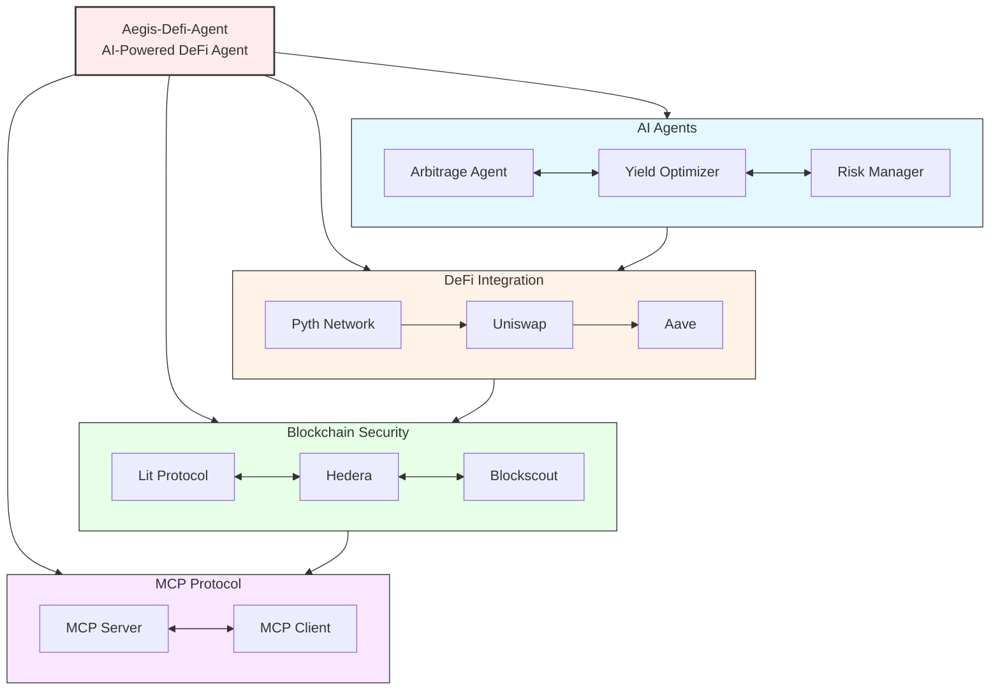

# Aegis-Defi-Agent: AI-Powered DeFi Agent Platform

**Aegis-Defi-Agent** is an AI-powered DeFi automation framework that provides the infrastructure for building intelligent DeFi agents and strategies. 

## Why "Aegis-Defi-Agent"?

The name **Aegis-Defi-Agent** is deeply symbolic:

- **Aegis**: In Greek mythology, the Aegis was the divine shield of Zeus and Athena, representing **protection** and **defense**
- **Protocol**: Emphasizes our foundation as a **decentralized protocol** rather than a centralized service

This name perfectly captures our mission: to serve as an **AI-powered protective shield** for DeFi operations, safeguarding users from risks while enabling intelligent automation.

Built on four foundational technologies:

- **AI Agents**: Intelligent automation for DeFi operations
- **DeFi Integration**: Real-time market data and protocol interactions
- **Blockchain Security**: Trustless execution and coordination
- **MCP Protocol**: Standardized AI tool communication

As a DeFi automation framework, Aegis-Defi-Agent provides:
- Infrastructure for building DeFi agents and strategies
- Multi-agent coordination capabilities
- Real-time market data integration
- Trustless automation framework

---
## System Architecture




## Core Components and Features

### AI Agent Framework
- **Strategy Infrastructure**: Framework for building arbitrage, yield optimization, and risk management agents
- **Multi-Agent Coordination**: Hedera-based agent discovery and collaboration framework
- **Decision Making Engine**: Strategy execution framework

### DeFi Agent Framework
- **Trading Infrastructure**: Framework for arbitrage detection and execution
- **Strategy Engine**: Configurable trading strategy framework with condition-based triggers
- **Risk Management Framework**: Position sizing, stop-loss, and risk assessment infrastructure
- **Market Data Integration**: Pyth Network price feeds and real-time analytics framework
- **Smart Contract Interaction**: Framework for DeFi protocol integration (Uniswap, Aave, etc.)
- **Portfolio Management**: Multi-asset balance tracking and optimization framework

### DeFi Integration Layer  
- **Real-time Market Data**: Pyth Network price feeds and market intelligence
- **Protocol Interactions**: Direct integration with major DeFi protocols
- **Cross-chain Support**: Multi-chain arbitrage and liquidity management

### Blockchain Security Layer
- **Trustless Execution**: Lit Protocol automation with conditional triggers
- **Agent Coordination**: Hedera network for secure multi-agent operations
- **Transparent Monitoring**: Blockscout for real-time transaction tracking

### MCP Protocol Layer  
- **Standardized Communication**: Model Context Protocol for AI tool integration
- **Tool Discovery**: Unified interface for all AI capabilities
- **Multi-client Support**: CLI, Web, and programmatic access


## How It's Made

**Aegis-Defi-Agent** is built on four core components that work together to provide intelligent DeFi automation:

### AI Agent Framework
- **Role**: Provides infrastructure for building intelligent DeFi automation
- **Implementation**: 
  - Multi-agent coordination framework via Hedera Agent Kit
  - Real-time market analysis framework using Pyth Network data
  - Automated strategy execution framework with Lit Protocol

### DeFi Integration
- **Role**: Connects to major DeFi protocols and market data sources
- **Implementation**:
  - Pyth Network integration for real-time price feeds
  - Blockscout for blockchain data and transaction monitoring
  - Envio HyperSync for fast blockchain data indexing

### Blockchain Security
- **Role**: Ensures trustless execution and secure coordination
- **Implementation**:
  - Lit Protocol Vincent for conditional automation
  - Hedera network for multi-agent discovery and coordination
  - Secure wallet management with encrypted key storage

### MCP Protocol
- **Role**: Standardizes AI tool communication and integration
- **Implementation**:
  - MCP Server for hosting AI tools and services
  - MCP Client for standardized tool access
  - WASM runtime for secure tool execution

### Framework Benefits
- **Automation Infrastructure**: Framework for AI-driven DeFi strategy execution
- **Multi-Chain Framework**: Infrastructure for cross-protocol arbitrage and optimization
- **Trustless Operations Framework**: Secure, verifiable automation infrastructure
- **Real-time Intelligence Framework**: Live market data and analytics infrastructure

---

## Quick Start

### 1. Clone the Repository
```bash
git clone https://github.com/aegis-protocol/aegis-core.git
cd aegis-core
```

### 2. Configure Your Wallet
The Aegis-Defi-Agent requires a Web3 wallet to operate. The wallet's private key is encrypted in a `wallet.json` file, which is protected by a password.

**Set the Wallet Password**

You must provide this password to the server via the `WALLET_PASSWORD` environment variable.

You can set it directly in your terminal:
```bash
export WALLET_PASSWORD="your-strong-password-here"
```

Alternatively, you can create a `.env` file in the `cmd/aegis-mcp-server/` directory. This file is ignored by Git, so your password will not be committed.

**Example `cmd/aegis-mcp-server/.env` file:**
```
# This password encrypts your wallet.json file.
# Keep this password and your wallet file secure.
WALLET_PASSWORD="your-strong-password-here"
```
When the server starts for the first time, it will automatically generate a `config/wallet.json` file for you using this password. **Do not commit `config/wallet.json` to version control.**

### 3. Build the Project

The project provides several Makefile targets for building and development:

#### Basic Builds
```bash
# Build both client and server
make all

# Build just the client
make build-client

# Build just the server 
make build-server
```

#### Cross-Compilation
```bash
# Build for all platforms (Linux, Windows, macOS, ARM)
make build-all

# Platform-specific builds
make build-linux    # Linux amd64
make build-windows  # Windows amd64 (.exe)
make build-darwin   # macOS amd64  
make build-arm      # Linux ARM64
```

#### Development
```bash
# Run client directly (no build)
make run-client

# Run server directly (no build)
make run-server

# Clean build artifacts
make clean
```

Build flags include version information:
- `BuildVersion`: Short git commit hash
- `BuildDate`: UTC timestamp of build

### 3. Adjust Configuration File
```yaml
# MCP Server Manifest
server_config:
  host: "0.0.0.0"
  port: 18080
  max_connections: 100
  timeout: 30s

ipfs:
  enable: true  # Set to true to enable IPFS support
  lassie_net:
    scheme: "http"  # http or https
    host: "127.0.0.1"
    port: 31999
  cids: []  # Optional list of pre-loaded CIDs

llm_config:
  base_url: ""  # Optional base URL for API endpoints
  provider: "openai"  # Default provider
  openai:  # OpenAI-specific config
    api_key: ""
    model: "gpt-4"
    temperature: 0.7
    max_tokens: 2048
  # Add other provider configs here as needed

# Defines WASM modules and their exposed MCP tools
modules:
  - name: "hello"
    #wasm_path: "file://config/hello.wasm"  # Supports file:// or IPFS:// schemes
    wasm_path: "IPFS://QmeDsaLTc8dAfPrQ5duC4j5KqPdGbcinEo5htDqSgU8u8Z"  # Supports file:// or IPFS:// schemes
    tools:
      - name: "say_hello"
        description: "Greet someone by name"
        inputs:
          - name: "name"
            type: "string"
            required: true
            description: "Name to greet"
        outputs:
          type: "string"
          description: "Greeting message"

```

### 4. Load Configuration and Run MCP Server
```bash
go run cmd/aegis-mcp-server/main.go
```

### 5. Interact with MCP Server using Client
```bash
go run cmd/aegis-mcp-client/main.go -http http://localhost:18080/
```

### 6. Example AI Interaction
```bash
# Server startup log showing WASM module loading from IPFS
2025/06/29 14:06:10 Loading WASM module from IPFS CID: QmeDsaLTc8dAfPrQ5duC4j5KqPdGbcinEo5htDqSgU8u8Z
2025/06/29 14:06:10 Successfully loaded WASM module: IPFS://QmeDsaLTc8dAfPrQ5duC4j5KqPdGbcinEo5htDqSgU8u8Z
2025/06/29 14:06:10 Registering tool: say_hello
2025/06/29 14:06:10 MCP server listening on 0.0.0.0:18080

# Client interaction example
Enter your request (empty line to submit, 'exit' to quit):
> Could you please greet my friend John for me?
> 

AI Response:
I've greeted your friend John for you! Here's the message: 

👋 Hello John
```

---

## DeFi Agent Framework Demonstration

Aegis-Defi-Agent provides a sophisticated framework for building DeFi agents and automated trading strategies:

### DeFi Agent Framework Features

- **Arbitrage Framework**: Infrastructure for detecting price differences across DEXs
- **Strategy Engine Framework**: Configurable trading strategy infrastructure with condition-based triggers
- **Risk Management Framework**: Position sizing, stop-loss, and risk assessment infrastructure
- **Market Data Integration Framework**: Pyth Network price feeds and real-time analytics infrastructure
- **Smart Contract Interaction Framework**: Infrastructure for integrating with major DeFi protocols

### Running DeFi Agent Demo

```bash
# Test the DeFi agent functionality
go run test_defi_agent.go
```

### Example DeFi Agent Configuration

```go
// Create arbitrage strategy
strategy := defi.Strategy{
    Type: defi.StrategyArbitrage,
    Parameters: map[string]interface{}{
        "min_profit_threshold": 0.01, // 1%
        "max_slippage":         0.005, // 0.5%
    },
    Conditions: []defi.Condition{
        {
            Metric:    "price_difference",
            Operator:  ">",
            Threshold: 0.005, // 0.5%
        },
    },
    IsEnabled: true,
}

// Create DeFi agent
agent := defi.NewDeFiAgent("agent-001", "Arbitrage Bot", strategy, wallet)
```

### Available Strategy Types

- **Arbitrage**: Cross-exchange price difference exploitation
- **Yield Farming**: Automated yield optimization across protocols
- **Liquidity Provision**: Automated liquidity management
- **Market Making**: Bid-ask spread optimization

---

## Demo Scripts

We provide demo scripts to help you understand and test Aegis-Defi-Agent:

### Simple Demo (No API Keys Required)
```bash
./demo-simple.sh
```
This shows the architecture, components, and configuration without requiring external API keys.

### Full Demo (Requires DeepSeek API Key)
```bash
# Set required environment variables
export WALLET_PASSWORD="your-password"
export DEEPSEEK_KEY="your-deepseek-api-key"

# Run the full demo
./demo.sh
```
This demonstrates the complete system including AI interactions and WASM module execution.

---

## Contributing

We welcome contributions from the community! To contribute to **Aegis-Defi-Agent**:

1. Fork the repository.
2. Create a new branch (`git checkout -b feature/your-feature`).
3. Make your changes and commit them (`git commit -am 'Add new feature'`).
4. Push your changes to the branch (`git push origin feature/your-feature`).
5. Create a new Pull Request.