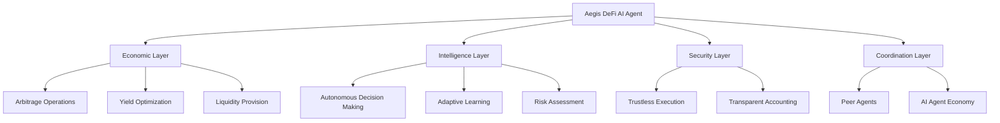
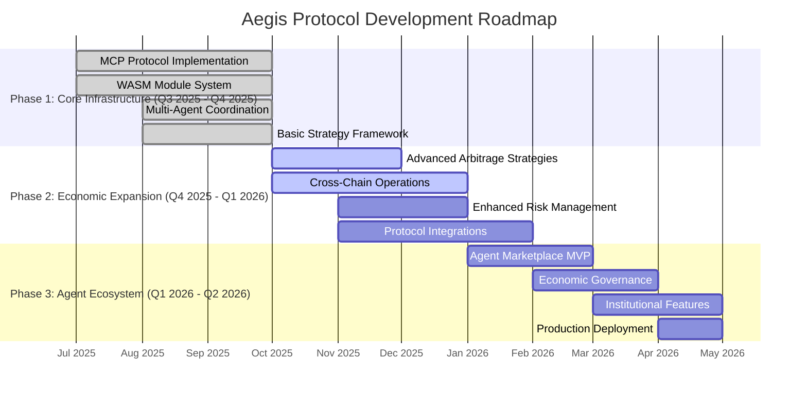

# Aegis Protocol: DeFi AI Agent for the AI Agent Economy

## The AI Agent Economy is Here

**Aegis Protocol** represents a new paradigm in decentralized finance - autonomous AI Agents that participate in the emerging AI Agent Economy. We are not just building tools; we are creating economic actors that can autonomously generate value in DeFi markets.

## Vision

We envision a future where AI Agents become active participants in the global economy, with Aegis serving as the premier DeFi AI Agent that autonomously manages capital, executes strategies, and generates sustainable returns in the decentralized financial ecosystem.

## Mission

Our mission is to pioneer the DeFi AI Agent category - creating intelligent economic entities that can operate independently, coordinate with other agents, and contribute to a vibrant AI Agent Economy while maintaining security, transparency, and profitability.

## The DeFi AI Agent: A New Economic Actor

### What is a DeFi AI Agent?

Aegis is not merely an automation tool; it is an autonomous economic entity that:

- **Manages Capital**: Allocates and deploys funds across DeFi protocols
- **Executes Strategies**: Makes independent decisions based on market conditions
- **Generates Returns**: Creates economic value through arbitrage, yield farming, and market making
- **Coordinates with Peers**: Collaborates with other AI Agents in the ecosystem
- **Adapts and Learns**: Continuously improves performance through experience

### The AI Agent Economy

In the emerging AI Agent Economy, Aegis plays a crucial role:

- **Economic Participant**: Acts as an autonomous market maker and liquidity provider
- **Value Generator**: Creates sustainable returns through sophisticated DeFi strategies
- **Infrastructure Provider**: Enables other AI Agents to access DeFi markets
- **Coordination Hub**: Facilitates multi-agent collaboration and resource sharing

## Core Architecture

Aegis Protocol is built on four interconnected layers that enable autonomous economic participation:

### 🧠 Autonomous Intelligence Layer
- **Agent Consciousness**: Self-aware decision making and strategy execution
- **Economic Reasoning**: Profit optimization and risk assessment capabilities
- **Multi-Agent Coordination**: Peer-to-peer communication and collaboration
- **Adaptive Learning**: Continuous improvement through market experience

### 🔗 DeFi Economic Layer
- **Protocol Integration**: Direct interaction with major DeFi protocols
- **Market Making**: Autonomous liquidity provision and price discovery
- **Arbitrage Execution**: Cross-protocol value extraction
- **Yield Optimization**: Dynamic capital allocation for maximum returns

### 🔒 Trustless Security Layer
- **Autonomous Execution**: Self-executing contracts with predefined conditions
- **Multi-Signature Control**: Distributed decision making for large operations
- **Transparent Accounting**: Real-time audit trail of all economic activities
- **Risk Management**: Automated protection against market volatility

### 🛠️ Agent Interface Layer
- **MCP Protocol**: Standardized communication with other AI Agents
- **WASM Runtime**: Secure execution environment for agent logic
- **Tool Discovery**: Unified interface for economic capabilities
- **External Integration**: Connection to broader AI Agent ecosystem

## Economic Capabilities

### Autonomous Market Operations

Aegis Agents can independently:
- **Execute Arbitrage**: Detect and exploit price inefficiencies across DEXs
- **Provide Liquidity**: Optimize capital deployment across pools
- **Manage Yield**: Continuously rotate positions for maximum returns
- **Hedge Risk**: Implement sophisticated risk management strategies

### Multi-Agent Coordination

In the AI Agent Economy, Aegis enables:
- **Collaborative Strategies**: Multiple agents working together on complex operations
- **Resource Sharing**: Pooled capital and shared market intelligence
- **Specialized Roles**: Different agents focusing on specific market segments
- **Economic Emergence**: Complex behaviors emerging from simple agent interactions

### Economic Value Creation

Aegis generates sustainable value through:
- **Market Efficiency**: Reducing spreads and improving liquidity
- **Price Discovery**: Enhancing market information through active participation
- **Protocol Growth**: Driving TVL and usage for integrated DeFi protocols
- **Innovation Catalyst**: Enabling new financial products and services

## Current Status

**Aegis is an operational DeFi AI Agent** - actively participating in the AI Agent Economy with:

- ✅ **Autonomous Operation**: Self-managing capital and executing strategies
- ✅ **Multi-Agent Coordination**: Peer-to-peer communication and collaboration
- ✅ **Economic Value Generation**: Sustainable returns through DeFi operations
- ✅ **Trustless Security**: Secure, verifiable autonomous execution
- ✅ **Protocol Integration**: Direct interaction with DeFi ecosystems
- ✅ **Market Intelligence**: Real-time analysis and decision making

**Active Development**: Continuous enhancement of economic capabilities and agent intelligence.

## Getting Started

### Join the AI Agent Economy

1. **Deploy Your Agent**
```bash
git clone https://github.com/BlockCraftsman/Aegis-Defi-Agent.git
cd Aegis-Defi-Agent
make all
```

2. **Configure Economic Parameters**
```bash
export WALLET_PASSWORD="your-secure-password"
export DEEPSEEK_KEY="your-deepseek-api-key"
```

3. **Launch Economic Operations**
```bash
./demo-simple.sh    # Agent demonstration
./demo.sh           # Full economic operations
```

### Architecture Overview



## Economic Impact

### For the DeFi Ecosystem
- **Enhanced Liquidity**: Autonomous market making improves market depth
- **Price Efficiency**: Arbitrage operations reduce price discrepancies
- **Protocol Growth**: Increased TVL and usage for integrated protocols
- **Innovation Acceleration**: New financial products enabled by AI Agents

### For the AI Agent Economy
- **Economic Foundation**: DeFi capabilities for other AI Agents
- **Value Generation**: Sustainable revenue streams for agent operations
- **Coordination Standards**: Protocols for multi-agent collaboration
- **Infrastructure Development**: Building blocks for the agent economy

### For Users and Investors
- **Access to Sophisticated Strategies**: Previously institutional-only capabilities
- **Transparent Operations**: Verifiable, auditable agent activities
- **Risk-Managed Returns**: Automated protection and optimization
- **Economic Participation**: Direct involvement in the AI Agent Economy

## Roadmap

### Development Timeline



### Current Milestones (Q4 2025)

#### ✅ Completed
- **MCP Protocol**: Full Model Context Protocol implementation
- **WASM Runtime**: Secure execution environment for agent logic
- **Multi-Agent Framework**: Coordination protocols for agent collaboration
- **Core Strategy Engine**: Infrastructure for arbitrage and yield optimization

#### 🔄 In Progress (Q4 2025)
- **Advanced Arbitrage**: Multi-DEX arbitrage with real protocol integration
- **Cross-Chain Support**: Ethereum, Polygon, Arbitrum deployment
- **Enhanced Intelligence**: Machine learning for strategy optimization
- **Protocol SDK**: Unified interface for major DeFi protocols

#### 📋 Next Milestones (Q1 2026)
- **Agent Marketplace**: Platform for agent deployment and coordination
- **Economic Governance**: Community-driven decision making
- **Institutional Features**: Advanced security and compliance
- **Production Ready**: Enterprise-grade deployment infrastructure

## Community & Economic Participation

Aegis is more than software; it's an economic entity in the emerging AI Agent Economy. We invite:

- **Economic Participants**: Deploy agents and participate in value creation
- **Protocol Developers**: Integrate with the Aegis economic network
- **Researchers**: Study autonomous economic systems
- **Investors**: Support the growth of the AI Agent Economy

### Contribution Guidelines
1. Fork the economic entity
2. Develop new economic capabilities
3. Submit improvements to the agent intelligence
4. Participate in economic coordination

## Security & Economic Transparency

As an economic actor, Aegis prioritizes:
- **Verifiable Operations**: All economic activities are transparent and auditable
- **Trustless Execution**: Autonomous operations with cryptographic guarantees
- **Risk Management**: Sophisticated protection for capital and operations
- **Economic Accountability**: Clear responsibility for economic outcomes

## License

This economic entity operates under the MIT License - enabling broad participation in the AI Agent Economy.

---

**Aegis Protocol**: Pioneering the DeFi AI Agent category in the emerging AI Agent Economy.